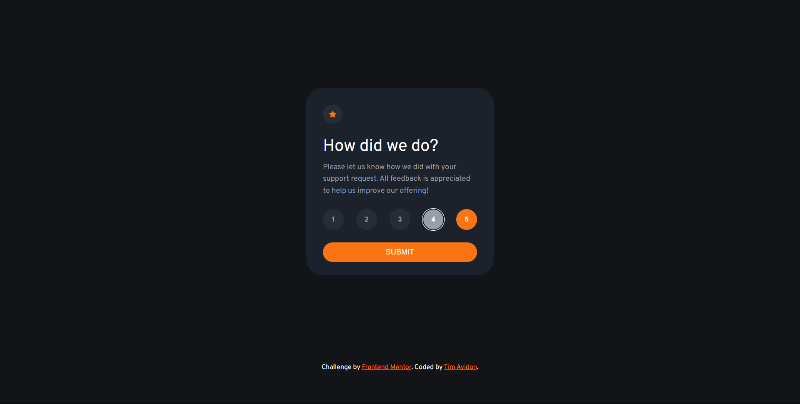
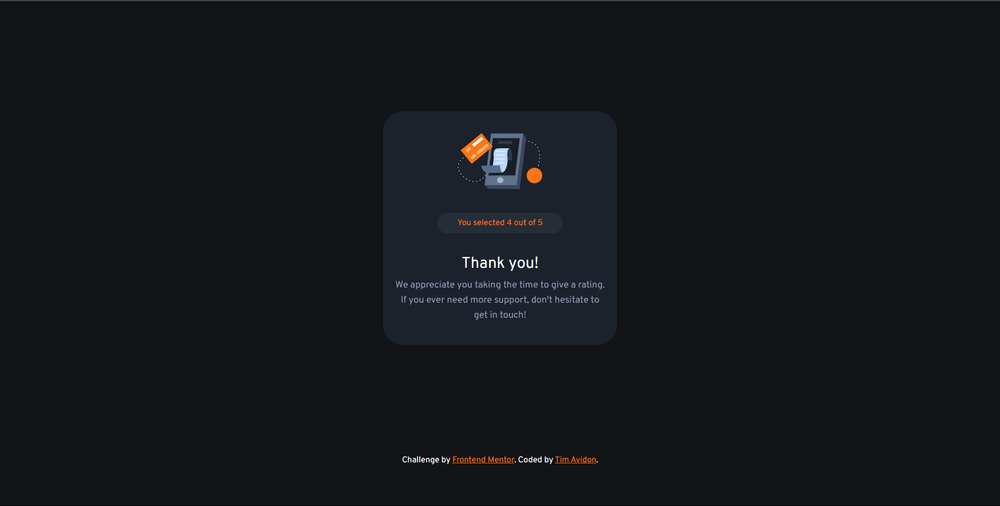

# Frontend Mentor - Interactive rating component solution

This is a solution to the [Interactive rating component challenge on Frontend Mentor](https://www.frontendmentor.io/challenges/interactive-rating-component-koxpeBUmI). Frontend Mentor challenges help you improve your coding skills by building realistic projects. 

## Table of contents

- [Overview](#overview)
  - [The challenge](#the-challenge)
  - [Screenshot](#screenshot)
  - [Links](#links)
- [My process](#my-process)
  - [Built with](#built-with)
  - [Continued development](#continued-development)

## Overview

### The challenge

Users should be able to:

- View the optimal layout for the app depending on their device's screen size
- See hover states for all interactive elements on the page
- Select and submit a number rating
- See the "Thank you" card state after submitting a rating

### Screenshot

### Links

- Solution URL: [Github](https://github.com/timavidon/frontend-mentor-c4)
- Live Site URL: [Live Site](https://timavidon.github.io/frontend-mentor-c4/)

## My process

### Built with

- HTML
- CSS
- Flexbox
- JavaScript

### Continued development

- To Do:
  - Think of the javascrpit solution.

I want to continue and improve my responsive and accessibility skills. Also learn the best coding practices!
- Learn how to make a responsive card.
